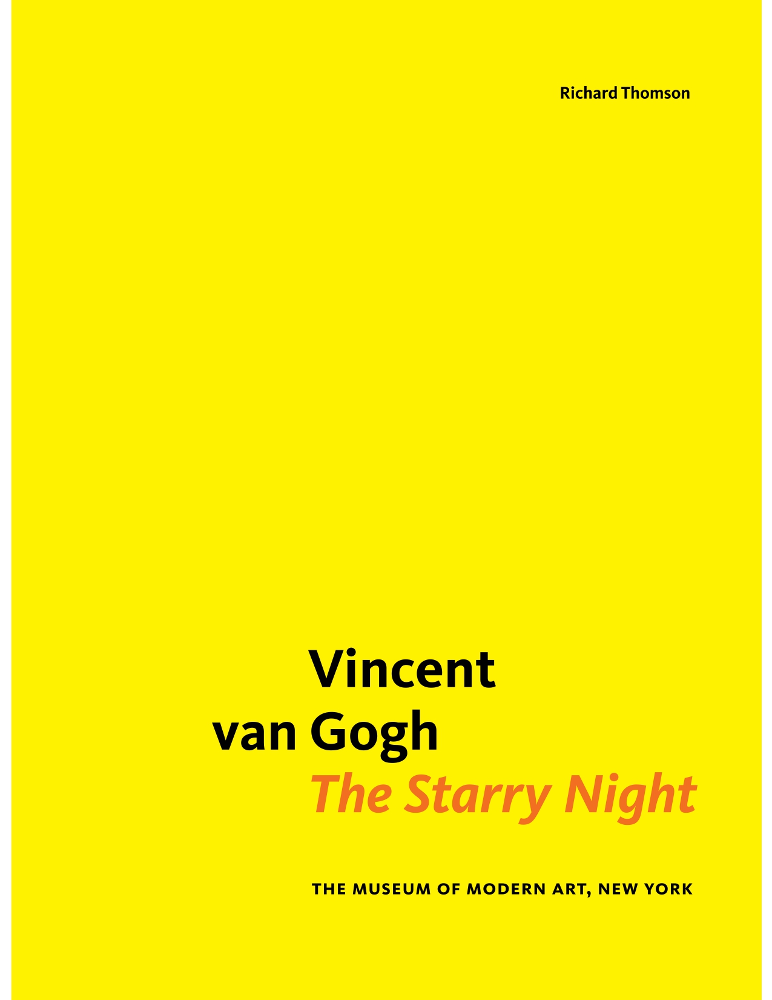

# 🔎 Project

<figure><figcaption></figcaption></figure>

> The project's goal was to develop an ontology for Vincent Van Gogh's renowned artwork "Starry Night" by examining two articles authored by art critics. An ontology serves as a structured portrayal of the ideas and connections found in a specific field, in this instance, the "Starry Night" painting.
>
> The project commenced by identifying the key concepts and connections that the art critics presented in their articles. This involved carefully analyzing the texts to extract relevant information and identify commonalities in how the critics discussed the painting.
>
> After determining the essential concepts and relationships, they were structured into a formal ontology. The ontology was intended to capture the structure and meaning of the critics' analysis of the painting, encompassing the various components of the painting and how they interrelate.
>
> The final outcome of the project was a comprehensive ontology for "Starry Night," which could be employed to facilitate further analysis and comprehension of the painting. The ontology could be used to answer questions about the meaning and importance of distinct elements of the painting and to explore the connections between them in more detail. Overall, the project aimed to deepen our understanding of one of the most celebrated paintings of all time and provide a valuable tool for art scholars and enthusiasts alike.

## <mark style="color:purple;">Workflow</mark>

📑 Reviews from Art Critics

_We have selected a pair of reviews written by art critics for analysis. The two reviews in question are titled "Van Gogh's Agony," authored by Lauren Soth, and "Vincent Van Gogh: The Starry Night," written by Richard Thomson. Our intention is to carefully examine and dissect the contents of these reviews, exploring the various perspectives, insights, and criticisms put forth by the respective authors._&#x20;

❓ <strong></strong> Competency Questions

_In the second step, we generated a series of competency questions designed to elicit the most relevant pieces of information from the source texts. By asking targeted questions, we hope to uncover the underlying themes and perspectives present in the texts, and gain a more comprehensive understanding of the ways in which Van Gogh's work has been received and evaluated. Through this process, we aim to develop a nuanced and well-informed perspective on the reviews and the broader discourse surrounding Van Gogh's art._

 🛠️ Development of Ontologies

_In this step, we focused on developing two ontologies to model a corpus of text as a network of classes and properties. Ontologies are frameworks that allow us to represent complex information in a structured and organized manner, making it easier to analyze and understand. The two ontologies we developed can be used to identify patterns and relationships within the corpus of text. By modeling the text as a network of classes and properties, we can gain a better understanding of how different concepts and ideas relate to one another._

🖇️ Ontologies Alignment and Merging

Step 4 requires aligning and merging ontologies developed in the third step. This step is essential for creating a comprehensive and accurate representation of the domain being studied. In order to align and merge the ontologies, the developed ontologies are compared to identify similarities and differences between them. Once the similarities and differences have been identified, the corresponding elements of the ontologies are mapped together to create a unified ontology. To further populate the aligned and merged ontologies, significant individuals related to the domain are added.

🧠 Knowledge Graph

The 5th step entails constructing a knowledge graph using a tool called RDFGrapher. RDFGrapher is an online application that enables users to visualize and explore RDF (Resource Description Framework) graphs. The knowledge graph is constructed by extracting relevant data from the ontology and organizing it into a format that can be easily represented as a graph. The resulting graph is then inputted into RDFGrapher, where it can be customized to highlight specific nodes or relationships.

👾 SPARQL Queries

The last step involves using SPARQL queries to answer competency questions. To answer competency questions using SPARQL, a series of queries are developed based on the ontologies and the specific questions being asked. These queries are designed to retrieve the relevant data from the ontology and present it in a format that can be easily understood and analyzed.

## <mark style="color:purple;">Sources</mark>

<table data-card-size="large" data-view="cards"><thead><tr><th align="center"></th><th align="center"></th><th></th><th data-type="content-ref"></th><th data-type="files"></th></tr></thead><tbody><tr><td align="center"><mark style="color:green;"><strong>Van Gogh's Agony</strong></mark></td><td align="center"></td><td><mark style="color:blue;"><strong>Author(s):</strong></mark><strong> Lauren Soth</strong> <mark style="color:blue;"><strong>Source:</strong></mark><strong> The Art Bulletin , Jun., 1986, Vol. 68, No. 2 (Jun., 1986), pp. 301-313</strong> <mark style="color:blue;"><strong>Published by:</strong></mark><strong> CAA</strong></td><td><a href="https://www.jstor.org/stable/3050939">https://www.jstor.org/stable/3050939</a></td><td><a href=".gitbook/assets/Lauren_Soth_Van_Gogh&#x27;s_Agony (1).pdf">Lauren_Soth_Van_Gogh's_Agony (1).pdf</a></td></tr><tr><td align="center"><mark style="color:green;"><strong>Vincent van Gogh: The Starry Night</strong></mark></td><td align="center"></td><td><mark style="color:blue;"><strong>Author(s):</strong></mark><strong> </strong><em><strong>Richard Thomson</strong></em> <em><mark style="color:blue;"><strong></strong></mark></em><mark style="color:blue;"><strong>Published by:</strong></mark><strong> The Museum of Modern Art (2008)</strong></td><td><a href="https://www.moma.org/momaorg/shared/pdfs/docs/learn/courses/Thomson_Van_Gogh_The_Starry_Night.pdf">https://www.moma.org/momaorg/shared/pdfs/docs/learn/courses/Thomson_Van_Gogh_The_Starry_Night.pdf</a></td><td><a href=".gitbook/assets/Richard_Thomson_Vincent_Van_Gogh_The_Starry_Night.pdf">Richard_Thomson_Vincent_Van_Gogh_The_Starry_Night.pdf</a></td></tr></tbody></table>

## <mark style="color:purple;">Team</mark>

<table data-card-size="large" data-view="cards"><thead><tr><th></th><th></th><th></th><th data-type="users" data-multiple></th></tr></thead><tbody><tr><td></td><td><mark style="color:yellow;"><strong>Anastasiya Sopyryaeva</strong></mark></td><td><em><mark style="color:orange;">anastasiy.sopyryaeva@studio.unibo.it</mark></em></td><td><a href="https://app.gitbook.com/u/ohUG5DdNIyVKS3Bj9zJKgdcbypE3">anastasiy.sopyryaeva</a></td></tr><tr><td></td><td><mark style="color:yellow;"><strong>Anita Vishinskaite</strong></mark></td><td><em><mark style="color:orange;">anita.vishinskaite@studio.unibo.it</mark></em></td><td><a href="https://app.gitbook.com/u/ykzyfOxYzpUtcwsOOOqEh9f6qCP2">anita.vishinskaite</a></td></tr></tbody></table>

